<!-- animated contribution graph: real data, boxes reveal cell by cell
     (regenerated daily by .github/workflows/update-profile-art.yml) -->

<h3><code>kushal@github ~ $ ./contributions.sh</code></h3>

 
 

<!-- ascii portrait (left) + neofetch info card (right). both svgs are
     840x880 so equal widths give equal heights.
     portrait: python scripts/prep_photo.py && python scripts/make_ascii_svg.py
     info card: python scripts/make_info_card.py
     (you can also swap info-card.svg with stats.svg for live streak tiles!) -->

<h3><code>kushal@github ~ $ whoami</code></h3>

<table>
<tr>
<td valign="top"></td>
<td valign="top"></td>
</tr>
</table>

 
 

<h3><code>kushal@github ~ $ ./links.sh</code></h3>

<b>Software Engineer · AI & Audio ML Builder</b>

 

